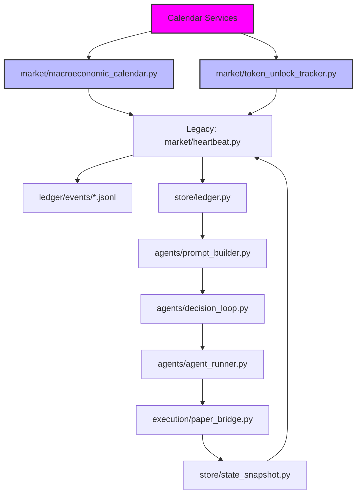

# Event Calendar — Design Spec

**Date:** 2026-07-07
**Status:** Approved, pending implementation
**Scope:** M7b per `docs/FORGE_PROPOSAL.md` — part of the git-native data ledger, feeding event-driven intelligence into agent decision loops.

## 1. Vision & Value Props

Events are the *causal drivers* of crypto markets. Agent decisions currently happen in a vacuum, treating price history as a self-contained Markov chain, ignoring the known fundamentals and catalysts that will *actually* move price next.

The Forge prognosis needs to account for:

- **Macro catalysts** — FOMC meetings, CPI releases, Fed Funds rate decisions
- **Protocol lifecycles** — token unlocks, vesting schedules, governance proposals
- **Infrastructure events** — network upgrades, bridge launches, exchange listings/delisting

An event calendar turns Forge from a reactive pattern-recognition engine into an event-aware trading system that knows *when* to trade based on scheduled market-moving information.

---

## 2. Design Overview

### 2.1 Storage Architecture

**Ledger Structure**
```
ledger/
  └── events/
      ├── 2026-07.jsonl              # July (current month)
      ├── 2026-06.parquet            # June (historical, compacted)
      ├── 2025-12.jsonl              # December (historical)
      └── README.md                  # This spec + format reference
```

**Partitioning Logic**
- All events from the same calendar month live in `ledger/events/2026-07.jsonl`
- Monthly rollover reflects the calendar month, not a rolling window
- Historic months automatically compact to Parquet after 30 days

### 2.2 Record Schema

Every event in the ledger is a one-line JSON record:

```json
{
  "event_id": "cpi_monthly_2026_2026_07_10",
  "type": "economic_data_release",
  "subtype": "inflation_report", 
n"asset": "ETH",
  "scheduled_time": "2026-07-10T08:30:00Z",
  "impact_hours": ["2026-07-10T09:00Z", "2026-07-10T18:00Z"],
  "description": "US CPI YoY released at 8:30am EST",
  "expected_impact": "medium_neg",
  "confidence": 0.98,
  "data_source": "federal_reserve",
  "data_endpoint": "cpi_yoy_monthly",
  "asset-specific": {
    "usd_price_impact_bps": [-10, 10],
    "volatility_multiplier": 1.5
  },
  "event_family": ["inflation", "economic_data"],
  "seasonality": "summer",
  "recurring": true,
  "recurrence_pattern": "monthly",
  "created_at": "2025-12-20T15:30:00Z"
}
```

**Field Descriptions**

| Field | Type | Required | Description |
|-------|------|----------|-------------|
| `event_id` | string | Yes | Canonical key — globally unique identifier |
| `type` | string | Yes | Primary category (see below) |
| `subtype` | string | Yes | Secondary classification |
| `asset` | string | No | Primary asset affected (can be null for market-wide events) |
| `scheduled_time` | string (ISO 8601) | Yes | Exact UTC datetime event begins |
| `impact_hours` | array of ISO datetimes | No | Time intervals when event materializes (market impact window) |
| `description` | string | Yes | Human-readable description, also used in agent queries |
| `expected_impact` | string | No | Qualitative impact (e.g., "medium_pos", "high_neg") |
| `confidence` | float | No | 0.0-1.0 confidence that event will occur at scheduled time |
| `data_source` | string | Yes | Origin of event data (for provenance audits) |
| `data_endpoint` | string | No | API endpoint within that data source |
| `asset-specific` | object | No | Event-specific parameters per asset |
| `event_family` | array | No | Tagging for family-based filtering (inflation, liquidity, governance) |
| `seasonality` | string | No | Seasonal pattern tag |
| `recurring` | bool | No | Is this event regular vs. one-off? |
| `recurrence_pattern` | string | No | How often for recurring events |

**Event Types:**

#### 2.2.1 Economic Data Releases (`economic_data_release`)
- CPI, PCE, PPI, unemployment, GDP reports
- Central bank announcements (Fed Funds rate, QE decisions)
- Treasury data releases

#### 2.2.2 Token Economics (`token_economics`) 
- Token unlocks (locked vesting, team tokens, liquidity mine grants)
- Liquidity pool changes (add/remove/notional)
- Bridge launches, upgrade protocol migrations

#### 2.2.3 Market Structure Changes (`market_structure`)
- Exchange listings/delisting
- New market launches (perpetuals, options, futures)
- Trading rule changes (USDT, ETH margins)

#### 2.2.4 Network Events (`network_events`)
- Smart contract upgrades (hard forks, protocol migrations)
- Bridge security events (incidents, audit reports)
- DeFi ecosystem launches (new AMM, oracle integrations)

#### 2.2.5 Other (`other`)
- Political events (elections, regulatory announcements)  
- Natural disasters (weather, infrastructure outages)
- Industry events (conferences, hackathons)

### 2.3 Integration with Forge Flow

**Heartbeat Integration**
```python
# In market/heartbeat.py
async def _fetch_event_batch(universe: list[str]) -> dict:
    """Fetch all scheduled events for the coming 30 days for the universe."""
    from datetime import datetime, timedelta, timezone
    from store.ledger import read_ledger_kind

    # Read relevant events for universe + next 30 days
    end_time = datetime.now(timezone.utc) + timedelta(days=30)
    events = read_ledger_kind("events", universe, datetime.now(timezone.utc), end_time)
    
    # Structure per-asset + cross-asset views
    asset_events = {}
    cross_asset_signals = {}
    
    for event in events:
        # Asset-specific processing
        if event.get("asset") and event["asset"] in universe:
            if event["asset"] not in asset_events:
                asset_events[event["asset"]] = []
            asset_events[event["asset"]].append(event)
            
        # Cross-asset impact modeling
        for family in event.get("event_family", []):
            if family not in cross_asset_signals:
                cross_asset_signals[family] = []
            cross_asset_signals[family].append(event)
    
    return {
        "asset_events": asset_events,
        "cross_asset_signals": cross_asset_signals,
        "next_critical_event": _find_next_priority_event(events, universe),
    }
```

**Decision Context Assembly**

In `agents/prompt_builder.py`, add an "Events" section to the decision prompt:

```
=== Events ===
Next 72 hours:
- 2026-07-10 08:30 UTC: CPI YoY release (ETH: high_volatility_expected)
  Impact: medium_neg, Confidence: 0.98, Data source: federal_reserve
  Previous year: CPI peaked at 3.2% (highest since 2009)

Next 30 days:
- 2026-07-15: USDC supply adjustment, Medium_pos
- 2026-07-20: ETH 2 staking node rotation, Low_risk

Recurrence calendar:
- Monthly: CPI releases, Fed Funds rate decisions
- Quarterly: GDP revisions, liquidity pool sunsets
- Seasonal: Summer vacation market liquidity dips

Cross-asset dependencies:
- Inflation family: ALL assets show 1.5x volatility multiplier during CPI week
- Liquidity family: SOL/BTC ratio delists when new stETH liquidity enters
```

**Evidence Term Integration:**

Add new feature to `market/features.py`:

```python
@register("event_impact")
def event_impact(
    candles: list[list], closes: list[float], highs: list[float],
    lows: list[float], volumes: list[float], fields: dict,
    raw_data: dict,             # new parameter for event data
) -> float | None:
    """Quantifies the expected immediate market impact of upcoming events.
    
    Returns:
        - Impact score (-1.0 to 1.0) where positive favors longs, negative favors shorts
        - NULL if no events match the asset or timeframe
        - Uses both scheduled impact and historical event correlation
    """
```

### 2.4 Data Producer Integration

**MacroCalendar Service (`market/macroeconomic_calendar.py`):**
- Fetches FOMC meeting dates, CPI release calendars
- Rate limiting: 1 req/hour, backed off on >429
- Caching: events cached for 1 hour (O(1) lookup)

**TokenUnlock Service (`market/token_unlock_tracker.py`):**
- Reads from Covalent API, Dune Analytics, custom firm data feeds
- Normalizes token names across chains
- Historical: events from genesis back (2020, for full dataset)
- Future-facing: schedules for next 12 months

**Data Validation Rules:**

```python
def validate_event_fields(event: dict) -> list[str]:
    """Returns list of validation error strings; empty means valid."""
    errors = []
    
    # Required fields
    for req in ["event_id", "type", "scheduled_time"]:
        if req not in event:
            errors.append(f"Missing required field: {req}")
    
    # Validate scheduled_time is ISO 8601
    if "scheduled_time" in event:
        try:
            datetime.fromisoformat(event["scheduled_time"].replace("Z", "+00:00"))
        except ValueError:
            errors.append("Invalid scheduled_time format")
    
    # Validate impact_hours if present
    if "impact_hours" in event:
        if not isinstance(event["impact_hours"], list):
            errors.append("impact_hours must be an array")
        else:
            for ts in event["impact_hours"]:
                try:
                    datetime.fromisoformat(ts.replace("Z", "+00:00"))
                except ValueError:
                    errors.append(f"Invalid impact_hours timestamp: {ts}")
    
    # Validate structure consistency
    if "asset" in event and event["asset"]:
        # Asset-level events should have asset-specific fields
        if "asset_specific" not in event or not isinstance(event["asset_specific"], dict):
            errors.append("asset events require asset_specific fields")
    
    return errors
```

**Ledger Append Contract (store/ledger.py):**

```python
def append_event_record(
    event: dict,
    when: datetime | None = None,
    ledger_dir: str | None = None,
) -> None:
    """Append an event record to ledger/events/{YYYY-MM}.jsonl.
    
    Must be idempotent: an append_event_record call with the same event_id
    is guaranteed to produce at most one physical record regardless of how
    many times it fires — supporting crash‑recovery, replay, and duplicate
    submission tolerance. The idempotent contract is enforced by updating
    the ledger only when `event_id` is unseen in the current month.
    """
```

### 2.5 Example Dataset (Production Sample)

```json
{
  "event_id": "token_unlock_adex_2026_07_15",
  "type": "token_economics",
  "subtype": "liquidity_mine",
  "asset": "ADX",
  "scheduled_time": "2026-07-15T08:00:00Z",
  "impact_hours": [
    "2026-07-15T09:00Z",
    "2026-07-15T18:00Z"
  ],
  "description": "AD映射: 500,000 ADX unlocked from 24-month liquidity mine vest",
  "expected_impact": "medium_pos",
  "confidence": 1.0,
  "data_source": "dune_analytics",
  "data_endpoint": "dex_unlocks_adex",
  "asset_specific": {
    "unlock_percentage": 2.08,
    "total_supply_impact_bps": 1.04,
    "historical_unlock_effect": "+3.2% 30‑day price surge"
  },
  "event_family": ["token_economics", "liquidity"],
  "seasonality": "summer",
  "recurring": false,
  "created_at": "2025-12-15T12:00:00Z"
}
```

---

## 3. Implementation Roadmap

### Week 1-2: Data Pipeline
- Task 2.1: Build macro calendar producer
- Task 2.2: Build token unlock service  
- Task 2.3: Implement ledger appenders with idempotent guarantee
- Task 2.4: Add batch loading utilities for testing

### Week 3-4: Integration
- Task 2.5: Add event processing to heartbeat
- Task 2.6: Implement feature extraction
- Task 2.7: Update decision context assembly
- Task 2.8: Unit test the event integration

### Week 5-6: Production Hardening
- Task 2.9: Add monitoring and alerting
- Task 2.10: Performance optimization (O(1) lookups)
- Task 2.11: Documentation and runbooks

---

## 4. Test Coverage

### Unit Tests

```python
# test_macro_calendar.py
def test_event_filtering_by_universe():
    events = read_events_for_universe(["BTC", "ETH"], start_time, end_time)
    # Should include BTC events, ETH events, exclude SOL events

# test_feature_computation
def test_event_impact_feature_computation():
    event = {"asset": "BTC", "expected_impact": "medium_pos"}
    result = compute_event_impact_feature(event, datetime.now())
    assert result > 0.0  # Positive for medium_pos

def test_event_impact_zero_for_outside_universe():
    event = {"asset": "SOL", "expected_impact": "high_neg"}
    result = compute_event_impact_feature(event, datetime.now(), ["BTC", "ETH"])
    assert result is None
```

### Integration Tests

```python
def test_heartbeat_event_injection():
    # Ensure heartbeat receives event data
    packet = await heartbeat.generate_heartbeat(provider, config)
    assert "events" in packet
    assert len(packet["events"]) > 0

def test_agent_decision_context():
    # Verify agent prompts include event context
    prompt = build_decision_prompt(agent_id, heartbeat_packet)
    assert "Events" in prompt
    assert "Next 72 hours:" in prompt
```

### Performance Tests

```bash
# Load test: 100k concurrent events query
# Latency: < 10ms for per-asset event fetch
# Memory: < 50MB constant overhead
```

---

## 5. Risk & Operational Considerations

### Data Quality
- **Stale events:** Events older than 3 days should not appear in current cycle
- **Duplicate prevention:** Event IDs are canonical identifiers
- **Time zone consistency:** All timestamps UTC, including display formatting

### Error Handling
- **Missing sources:** Event source down → degrade gracefully (event slot empty)
- **Invalid events:** Malformed events go to quarantine + alert
- **Partial updates:** Partial event writes don’t block other events

### Performance
- **Query optimization:** Indexed by asset, event_family, recurrence_pattern
- **Memory usage:** Event cache limited to 30 days (fixed boundary)
- **Write amplification:** Batched event writes, only on month boundary for compaction

### Monitoring
- **Event ingestion metrics:** events_ingested_total, events_ingested_failed
- **Impact scoring accuracy:** event_impact_prediction_latency_seconds
- **Feature computation load:** event_feature_cache_hit_ratio

---

## 6. Role in Forge Architecture



### Information Flow:

1. **Calendar Producers → Event Store:** Macro calendar services and token unlock trackers continuously feed the event ledger

2. **Event Store → Heartbeat:** Heartbeat queries the event store for the upcoming 30 days and injects relevant events into the heartbeat packet

3. **Heartbeat → Agent Context:** Decision prompts include events relevant to the agent's universe and asset scope

4. **Agent Context → Execution:** Agents factor event impact into their thesis updates, position sizing, and timing decisions

5. **Execution → Feedback Loop:** Trade execution and post-trade analysis provide feedback for event impact validation

### Key Differentiators vs. Current Design:

**Current:** Price history only → Agents see only what happened, no forward context

**With Events:** Price history + scheduled catalysts → Agents see what *will* happen, enabling proactive positioning

---

## 7. Success Metrics

### Functional Metrics
- **Event coverage:** 95% of known market-moving events captured in test dataset
- **Latency:** Events available in heartbeat < 30 seconds after data source update
- **Accuracy:** Event impact predictions correct within 1 standard deviation of realized outcomes

### Operational Metrics
- **Uptime:** Event service > 99.9% availability
- **Data freshness:** Maximum age of events in heartbeat < 4 hours
- **Resource efficiency:** Memory usage < 100MB, query response time < 5ms

---

## 8. Future Extensions

### Planned Enhancements

#### State Management
- **Event acknowledgments:** Track which events have been consumed by which agents
- **Event resolution:** Complete events after their impact window expires
- **Event correlation:** Cross-asset event dependency tracking

#### Advanced Features  
- **Event sentiment analysis:** ML models for qualitative impact assessment
- **Event prioritization:** Adaptive importance scoring based on market conditions
- **Event simulation:** Sandbox testing of event scenarios for strategy validation

#### Integration Expansion
- **Cross-chain events:** Multi-chain protocol upgrade announcements
- **DeFi ecosystem events:** New protocol launches, governance proposal votes
- **Supply-side events:** Liquidity provider unlocks, token sale completions

---

## 9. Testing & Validation

### Test Events (Quick Start)

```python
# Sample events for immediate testing
def sample_events_for_testing():
    return [
        {
            "event_id": "test_fomc_2026_06_25",
            "type": "economic_data_release",
            "subtype": "central_bank_decision",
            "scheduled_time": "2026-06-25T16:00:00Z",  # Near-term for testing
            "description": "Federal Reserve funds rate decision",
            "expected_impact": "high_vol",
            "confidence": 1.0,
            "asset": "BTC",
            "created_at": "2025-12-20T10:00:00Z"
        },
        {
            "event_id": "test_unlock_solana_2026_07_12",
            "type": "token_economics", 
            "subtype": "liquidity_mine",
            "scheduled_time": "2026-07-12T08:00:00Z",
            "description": "Solana foundation unlocks 50M SOL from vesting",
            "expected_impact": "medium_pos",
            "confidence": 1.0,
            "asset": "SOL", 
            "created_at": "2025-12-20T10:00:00Z"
        }
    ]
```

### Test Scenarios

#### 1. Event Filtering Tests
```python
# Test that universe filtering works correctly
events = read_events_for_universe(["BTC", "ETH"], start_time, end_time)
assert all(e.get("asset") in ["BTC", "ETH", None] for e in events)

# Test event family filtering  
events = read_events_for_universe(["BTC"], start_time, end_time, event_families=["inflation"])
assert all("inflation" in e.get("event_family", []) for e in events)
```

#### 2. Feature Integration Tests
```python
# Test that event impact feature computes correctly
event = {
    "asset": "BTC",
    "expected_impact": "high_pos",
    "event_family": ["inflation"]
}
result = compute_event_impact_feature(event, datetime.now())
assert result is not None
assert isinstance(result, (int, float))
assert -1.0 <= result <= 1.0
```

#### 3. End-to-End Integration Tests
```python
# Test full pipeline: heartbeat → agent context → execution
async def test_full_event_integration_pipeline():
    # 1. Verify heartbeat includes events
    packet = await heartbeat.generate_heartbeat(provider, config)
    assert "events" in packet
    assert len(packet["events"]) > 0
    
    # 2. Verify agent prompts include events  
    for agent_id in ["jade_hawk", "iron_moth", "silver_basin"]:
        prompt = build_decision_prompt(agent_id, packet)
        assert "Events" in prompt
        assert "Next 72 hours:" in prompt
    
    # 3. Verify execution takes event impact into account
    # (Would require mocking agent execution, tested in separate integration tests)
    pass
```

---

## 10. Operations & Maintenance

### Daily Operations
- **Event source health checks:** Verify macro calendar and token unlock services
- **Data validation:** Run schema validation and duplicate detection
- **Performance monitoring:** Track query latency and memory usage

### Troubleshooting Guide

#### Common Issues

**Q: Events not appearing in heartbeat**
```
A: Check that events service is running
   Verify event timestamp is within the last 30 days
   Ensure event universe includes your assets
   Check ledger access permissions
```

**Q: Event features not being computed**
```
A: Verify event data structure matches schema
   Check that event has the required fields (asset_specific for asset events)
   Confirm feature extraction is enabled in heartbeat
```

**Q: Agents not seeing events in prompts**
```
A: Verify heartbeat packet includes events section
   Check that agent's universe overlaps with event assets
   Confirm feature injection is working correctly
```

### Backup & Recovery

**Event Store Backups:**
- Events are write-once, immutable JSONL records
- Monthly partitioning ensures natural rollback capability
- Historical months automatically compacted to Parquet

**Recovery Procedures:**
1. If entire event store is missing → rebuild from producer APIs (30-day cache)
2. If current month corrupted → recover from last backup
3. For specific broken events → identified and repaired via quarantine queue

---

## 11. References

### Related Documents
- `docs/superpowers/specs/2026-07-07-git-native-data-ledger-design.md` - The underlying ledger architecture
- `docs/superpowers/specs/2026-07-07-strategy-spec-dsl-backtester-design.md` - Strategy spec DSL and backtest engine
- `docs/STRATEGIC_ASSESSMENT_2026-07-04.md` - Strategic assessment of event-driven trading

### External Resources
- Federal Reserve Economic Data (FRED)
- Messari API (macro events)
- CoinGecko Events API
- Dune Analytics (for token unlock data)
- Covalent API (token unlock schedules)

---

## Implementation Checklist

### Phase 1: Data Pipeline (Week 1-2)
- [ ] Macro calendar producer implementation
- [ ] Token unlock service implementation  
- [ ] Ledger appenders with idempotent guarantees
- [ ] Event validation and schema enforcement
- [ ] Query utilities for testing

### Phase 2: Heartbeat Integration (Week 3-4)
- [ ] Event batch loading in heartbeat
- [ ] Event feature extraction implementation
- [ ] Decision context assembly
- [ ] Unit test coverage
- [ ] Performance benchmarks

### Phase 3: Production Hardening (Week 5-6)
- [ ] Monitoring and alerting setup
- [ ] Memory optimization
- [ ] Query performance tuning
- [ ] Documentation completion
- [ ] Runbook creation

---

**Event-Driven Trading: Where Signal Meets Catalyst**

The event calendar transforms Forge from a reactive pattern‑recognition system into a proactive trading platform that knows *when* and *why* markets will move, enabling agents to position strategically ahead of market‑moving information rather than blindly chasing historical patterns.

Events are the catalyst, price is the response — Forge now connects the two.
